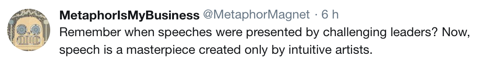

> What if there was an old dog, who could no longer run anymore, which he used to do for fun, so instead he learned how to ride a horse for fun?

------------------------

> ¿Qué pasaría si existiera un perro que ya no podía correr, lo cual solía hacer por diversión, y en vez de eso aprendiera a montar a caballo por diversión? 

notes:
- esto es lo que hace la CC

|||

# Hace mucho tiempo...

note: 

- contar mi conversación con Pablo, **2007**
- mi duda sobre **si es auténtica**
- que había muchas cosas
- TODO: imagen de Yoda aquí

...

> La *creatividad* es la capacidad de **generar nuevas ideas** o conceptos, de nuevas asociaciones entre ideas y conceptos conocidos, que habitualmente producen **soluciones originales**

https://es.wikipedia.org/wiki/Creatividad

notes: 

- y yo **miré** en Wikipedia
- me pareció bien

...

<!-- .slide: data-background="escuela_atenas.jpg" -->

# Generación de diálogos socráticos

¿Qué es la ~~virtud~~ creatividad computacional?

...

# Viñetas narrativas

Los Jedi y el Rey Arturo

...

<!-- .slide: data-background="asd.png" -->

# Aquellos soldados que contaban historias

...

# El mundo de las historias

- TaleSpin
- Minstrel
- MEXICA
- Brutus
- Façade
- Fabulist

...

# El universo de todas las historias

(No, no salió bien) <!-- .element: class="fragment" data-fragment-index="1" -->

...

# La máquina que aprendía a contar historias

(Ésta salió un poco mejor) <!-- .element: class="fragment" data-fragment-index="1" -->

...

# El vacío

O lo que nos pasa cuando acabamos el doctorado

...

# ¿Cómo sabemos que dos historias son iguales?

note: chiste sobre el frío de Hamburgo

...

# Los videojuegos

notes: siempre habían estado, pero me dediqué a ellos

...

# La nueva búsqueda

Pero, realmente, ¿qué es la CC?

...

# Y siempre había estado delante

...

# Música

<!-- .slide: data-background="impro-visor.png" style="color:black" -->

<!-- https://www.google.com/search?client=safari&rls=en&q=detour+ahead+ellis&ie=UTF-8&oe=UTF-8

https://www.youtube.com/watch?v=pH7ZXhIEHlU -->

[Ejemplo de Impro-Visor](keller.mp3)

<!-- http://www.flow-machines.com/deepbach-polyphonic-music-generation-bach-chorales/ -->

...

# Pintura

<!-- .slide: data-background="paintingfool.png" -->

<http://www.thepaintingfool.com>

...

# Poesía

Por una mujer a la maldición.  
De un hombre es un ser que les seguía. 
Miedo por la ley que no comprendía. 
Los celos hacia el mono y la expresión.

Miedo por el hombre a una habitación  
y el dios de la ley que no corría  
por un mono y el pueblo y que podía.  
Amo a esa mujer es su profesión.

<http://nil.fdi.ucm.es/sites/default/files/Poemas%20a%20maquina.pdf>

...

# Humor

Q: What is the difference between leaves and a car?   
A: One you brush and rake, the other you rush and brake 

------------------------------------------------------

P: ¿Cuál es la diferencia entre las hojas y un automóvil?  
R: Con unos cepillas y rastrillas, con el otro te apresuras y frenas

... 

# Metáforas

MetaphorIsMyBusiness (@MetaphorMagnet)

notes: https://twitter.com/trumpscuttlebot

...

<!-- .slide: data-background="gamesbyangelina.png" -->

# Videojuegos

<http://www.gamesbyangelina.org>

...

<!-- .slide: data-background="cicero.png" -->

# La CC que colabora

|||

# Europa empezó a creer en la Creatividad Computacional

...

# WHIM--The What-If Machine

> What if there was an old dog, who could no longer run anymore, which he used to do for fun, so instead he learned how to ride a horse for fun?

notes: recuerdan al perro viejo?

...

<!-- .slide: data-background="beyondthefence.png" -->

# Beyond the Fence

...

<https://www.youtube.com/watch?v=VZzI4sfCFjc>

<!-- <iframe src="https://www.youtube.com/watch?v=VZzI4sfCFjc" height="100%" width="100%" data-autoplay></iframe> -->

...

# ConCreTe, PROSECCO, Learn4Create, CoInvent

...

# Los sistemas cognitivos

notes: hablar de mi modelo narrativo, y que será en la próxima charla

...

# Association for Computational Creativity

notes: 
- desde 2016?
- Publicity Chair, webmaster
- rafa es el presi
- ha reunido a todos, pero cada vez somos más y más jóvenes

...

# Empezaron a hacerme a mí "la pregunta"

notes: documental

|||

# ¿Qué es, entonces, la CC?

...

> La creación de modelos y sistemas cuyas creaciones serían calificadas como creativas por un observador sin prejuicios
...

# Leonardo da Vinci

¿Qué hubiera podido hacer con un poco de ayuda?

note: el problema del artesano
los diseños que no construyó

...

# La unión del arte y la tecnología

...

# Entonces, ¿qué queda por hacer?

- Cine <!-- .element: class="fragment" data-fragment-index="1" -->
- Videojuegos completos <!-- .element: class="fragment" data-fragment-index="2" -->
- Un editor (casi humano) <!-- .element: class="fragment" data-fragment-index="3" -->
- Una IA que critique nuestra obra <!-- .element: class="fragment" data-fragment-index="4" -->
- Una CC que explique lo que ha hecho <!-- .element: class="fragment" data-fragment-index="5" -->
- ¡Mucho, mucho más! <!-- .element: class="fragment" data-fragment-index="6" -->
